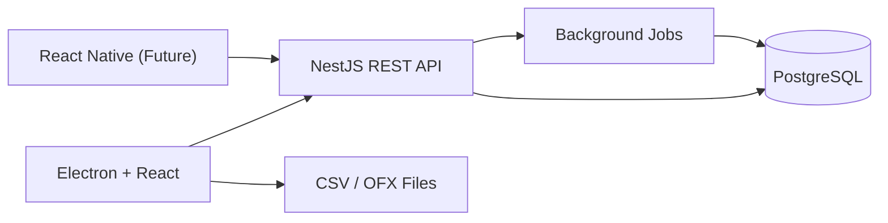
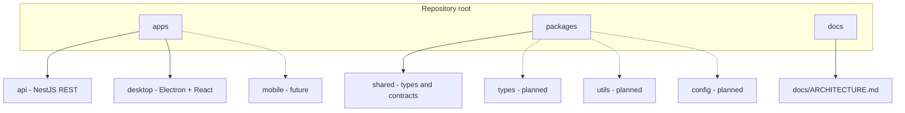
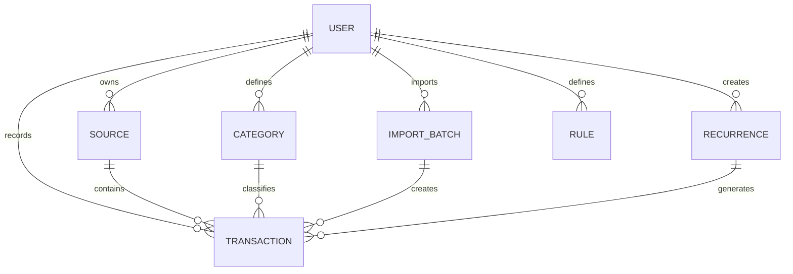
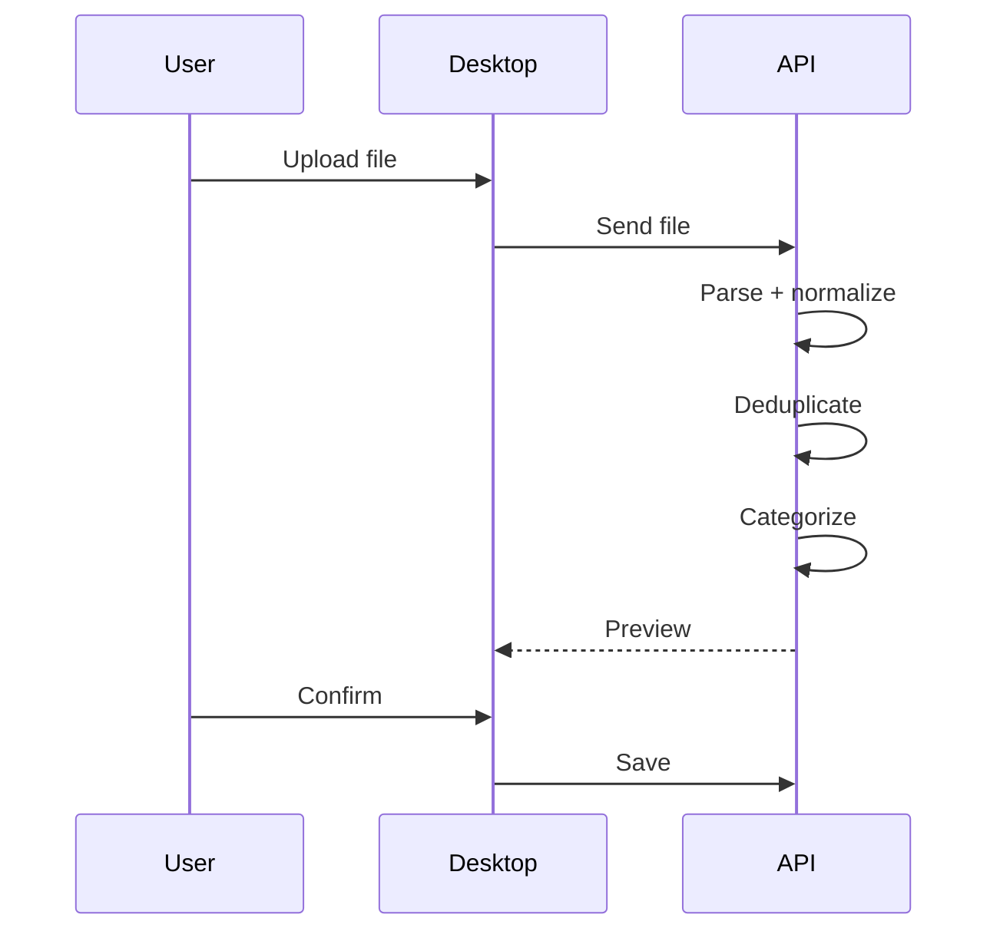
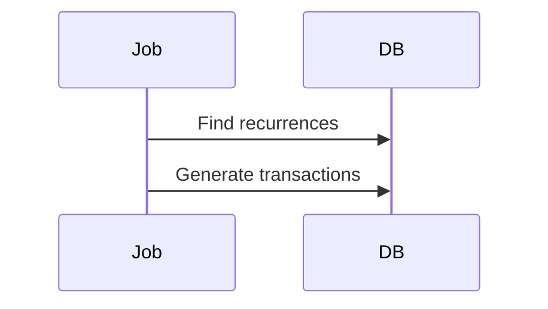

# Architecture

## Overview

This project is a personal finance tracking platform focused on importing, categorizing, and analyzing financial transactions.

The first client is a desktop application built with **Electron + React**. A future mobile client built with **React Native** is planned from the beginning, so architecture decisions must avoid coupling domain logic to the desktop client.

The backend is the **single source of truth** for persistence, validation, import processing, categorization rules, recurrence generation, and reporting.

This is **not** a banking platform. It does not require real-time balance synchronization with financial institutions. All balances and analytics are derived from imported or manually created records.

---

## Product Principles

- Keep MVP focused on financial history and analysis
- Backend owns all business logic
- UI clients remain thin
- Prefer explicit and simple architecture
- Avoid premature abstraction
- Design for future mobile reuse
- Deliver incrementally

---

## High-Level Architecture



---

## Responsibilities

### Desktop App

- Authentication flow
- File upload
- Import preview UI
- Transactions table
- Filters and search
- Charts and dashboard
- Forms (transactions, categories, sources, recurrences)

Must NOT:

- implement business rules
- own deduplication logic
- generate recurrences
- access database directly

---

### Backend API

- Authentication and authorization
- Data persistence
- Import processing
- Deduplication
- Categorization rules
- Recurrence generation
- Aggregation and reporting

---

### Database

- Store normalized entities
- Support filtering and aggregation
- Maintain referential integrity

---

## Monorepo structure (logical)



Solid lines: what exists today. Dotted lines: planned packages or apps.

---

## Repository layout

Use this section as the single reference for **where code lives**. The trees below stay in sync with the README overview.

### Implemented today

```text
wimm/
├── apps/
│   ├── api/                    NestJS REST API (persistence: Prisma + PostgreSQL — added with data layer)
│   └── desktop/                Electron + React + TypeScript
├── packages/
│   └── shared/                 Shared TypeScript types and API-facing contracts
├── docs/
│   └── ARCHITECTURE.md         Short pointer; full doc at repo root
├── ARCHITECTURE.md             Canonical architecture (this document)
├── README.md
├── package.json                pnpm workspace root
├── pnpm-workspace.yaml
├── turbo.json
└── tsconfig.base.json
```

### Planned (not in repo yet)

```text
wimm/
├── apps/
│   └── mobile/                 React Native client (future)
└── packages/
    ├── types/                  Optional split from shared — shared DTOs for API + clients
    ├── utils/                  Optional shared helpers
    └── config/                 Optional shared ESLint / TS config presets
```

**Note:** `packages/shared` may later be split into `types`, `utils`, and `config` when the mobile app or tooling needs clearer boundaries. Until then, keep shared contracts in `shared` only.

---

## Domain Model



---

## Core Entities

### User

- id
- email
- passwordHash

### Source

- id
- userId
- name
- type (bank_account | credit_card | cash | manual)

### Category

- id
- userId
- name
- type (income | expense)

### Transaction

- id
- userId
- sourceId
- categoryId
- type
- amount
- description
- occurredAt
- fingerprint

### ImportBatch

- id
- sourceId
- fileName
- type (csv | ofx)
- status

### Recurrence

- id
- type (indefinite | fixed)
- amount
- frequency
- startDate
- endDate

### Rule

- id
- pattern
- categoryId

---

## Key Decisions

- No real-time bank sync
- Credit card = normal source
- CSV + OFX only
- Deduplication via fingerprint
- REST API (no GraphQL yet)

---

## Import Flow



---

## Recurrence Flow


